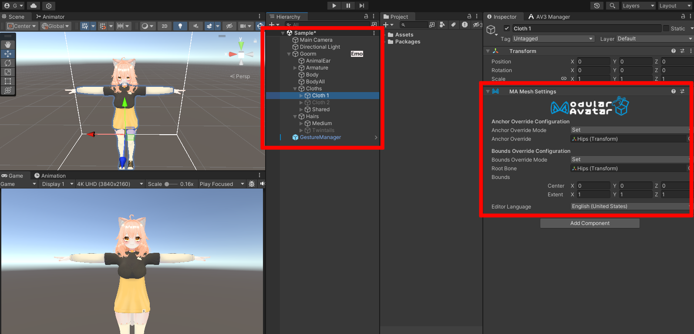
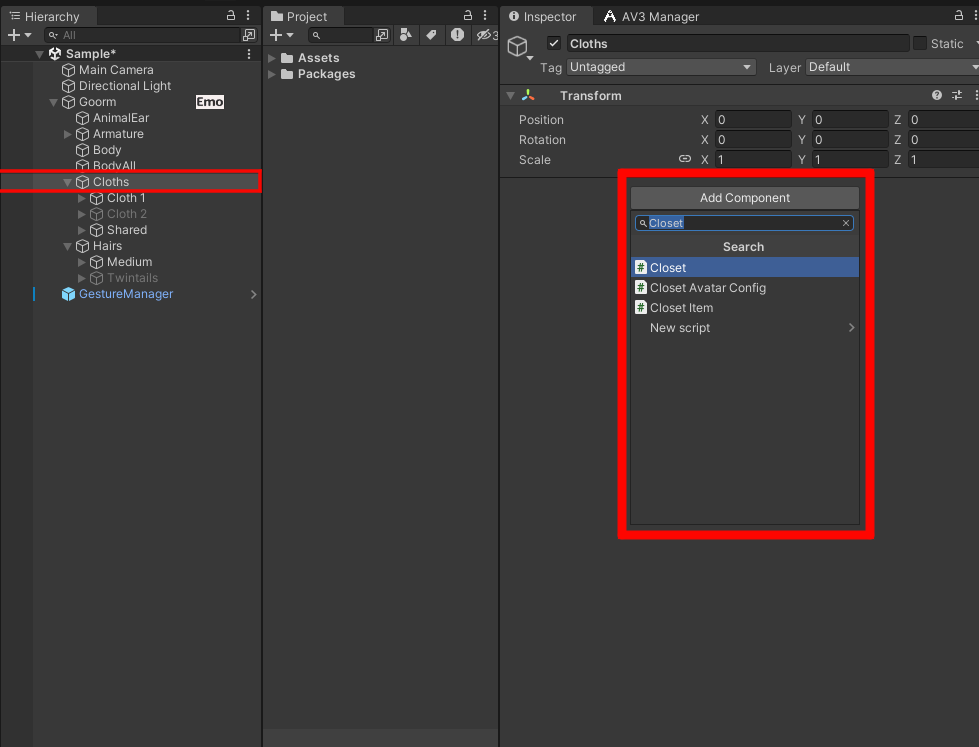
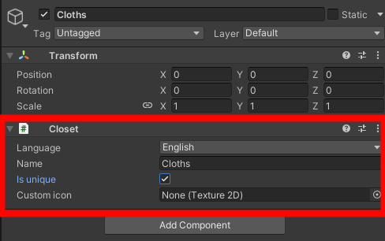
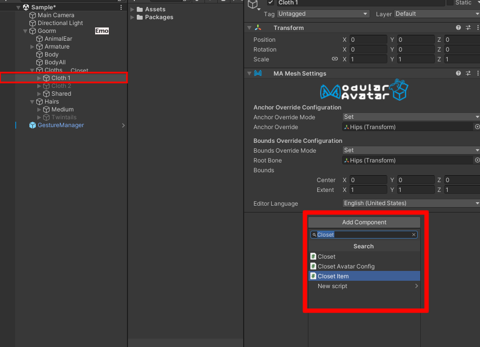
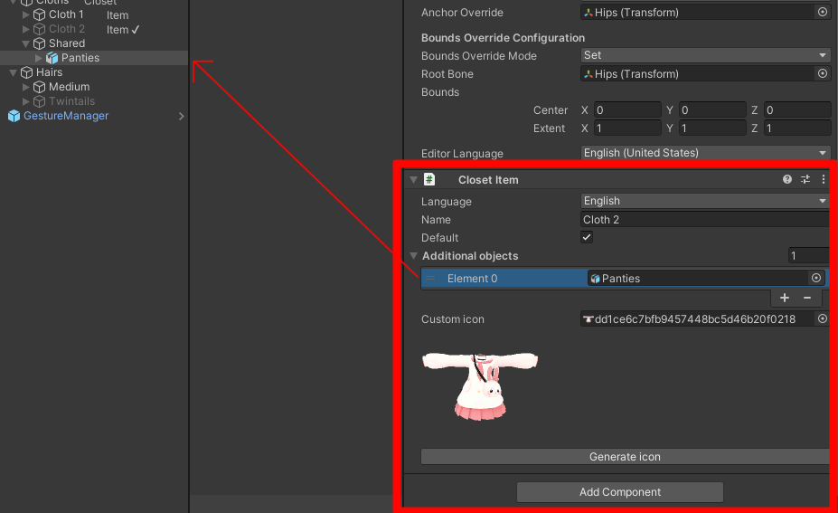

# 사용법



아바타에 옷을 입히세요 (모듈러 아바타를 사용해도 되고 손수 입혀도 됩니다)
하이어라키는 다음과 같은 구조로 구성되어야 합니다.

```
- 옷장 1
    - 옷 1
    - 그냥 게임 오브젝트
    - 옷 2
    - ...
- 옷장 2
    - 옷 3
    - 옷 4
    - 그냥 게임 오브젝트
        - 옷 5
    - ...
```



하이어라키에서 옷을 포함하고 있는 게임 오브젝트를 선택하고 'Closet' 컴포넌트를 추가하세요.



인스펙터에서 옷장의 속성을 수정하세요. 'Is unique (하나만 나오게 하기)' 옵션을 활성화하면 옷장에서 하나의 옷만 선택할 수 있게됩니다. (옷 선택 시 이미 입고있던 것은 비활성화 됨)



옷을 선택하고 'Closet Item' 컴포넌트를 추가하세요.



인스펙터에서 옷의 속성을 수정하세요.
'Default (기본)'은 해당 옷을 기본적으로 키도록 합니다.
'Additional objects (추가 오브젝트)'는 옷이랑 같이 보일 게임 오브젝트를 말합니다.
또한 버튼을 눌러서 아이콘을 생성할 수도 있습니다.

옷장을 전부 설정했다면 테스트하고 업로드하세요. 옷장은 유니티 에디터에서 플레이 버튼을 누르거나 VRChat에 업로드할 때 자동으로 적용됩니다.
